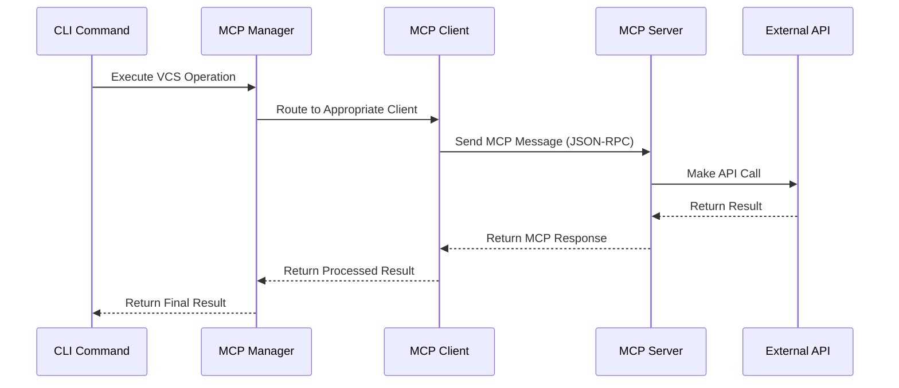
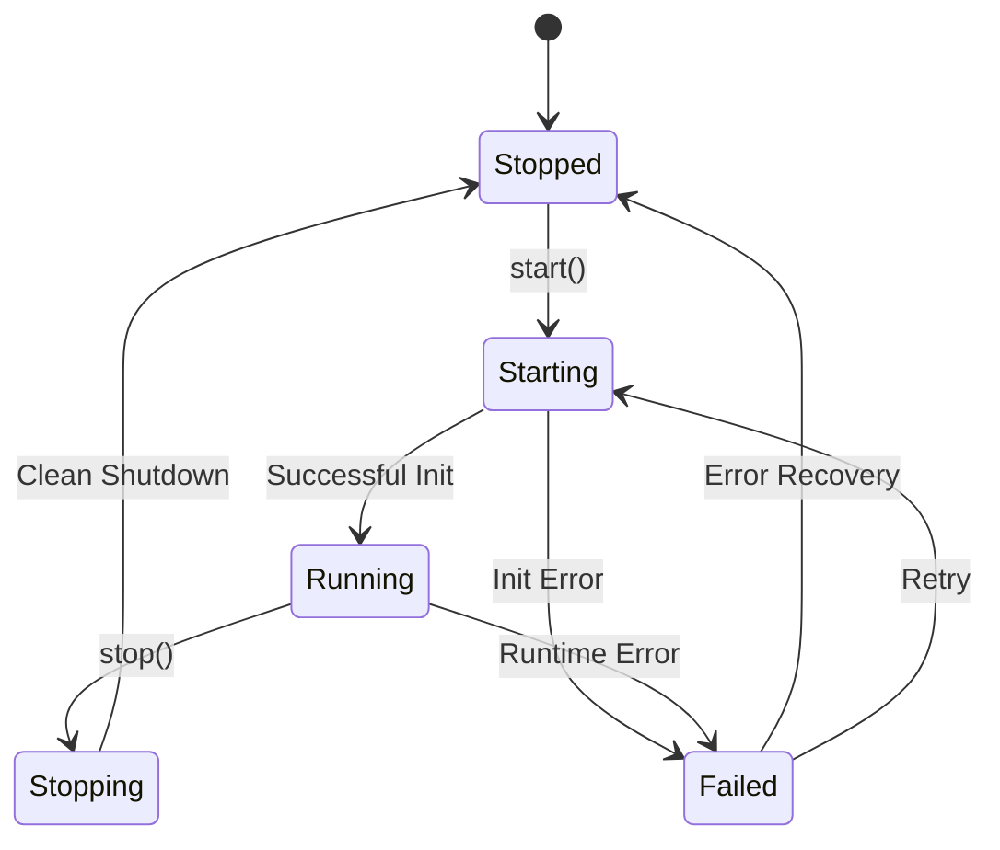

# MCP Integration Architecture

This document describes the architecture and design of the MCP (Model Context Protocol) integration in Nim TestKit.

## Overview

The MCP integration provides a unified interface for version control operations across multiple platforms (Git, GitHub, GitLab, Jujutsu) using the Model Context Protocol standard.

## Architecture Diagram

```
┌─────────────────────────────────────────────────────────────┐
│                    Nim TestKit CLI                         │
├─────────────────────────────────────────────────────────────┤
│                  MCP Commands Layer                        │
│  ┌─────────────┬─────────────┬─────────────┬─────────────┐  │
│  │   mcp_git   │ mcp_github  │ mcp_gitlab  │mcp_jujutsu  │  │
│  └─────────────┴─────────────┴─────────────┴─────────────┘  │
├─────────────────────────────────────────────────────────────┤
│                   MCP Manager                              │
│  ┌───────────────────────────────────────────────────────┐  │
│  │  • Server Lifecycle Management                       │  │
│  │  • Request Routing                                   │  │
│  │  │  • Error Handling & Recovery                     │  │
│  │  • Authentication Management                         │  │
│  └───────────────────────────────────────────────────────┘  │
├─────────────────────────────────────────────────────────────┤
│                   MCP Client Layer                         │
│  ┌─────────────┬─────────────┬─────────────┬─────────────┐  │
│  │ Git Client  │GitHub Client│GitLab Client│Jujutsu      │  │
│  │             │             │             │Client       │  │
│  └─────────────┴─────────────┴─────────────┴─────────────┘  │
├─────────────────────────────────────────────────────────────┤
│                 MCP Protocol Layer                         │
│  ┌───────────────────────────────────────────────────────┐  │
│  │  JSON-RPC 2.0 over STDIO/HTTP/SSE                    │  │
│  │  • Message Serialization/Deserialization             │  │
│  │  • Connection Management                              │  │
│  │  • Protocol Compliance                               │  │
│  └───────────────────────────────────────────────────────┘  │
├─────────────────────────────────────────────────────────────┤
│                   MCP Servers                              │
│  ┌─────────────┬─────────────┬─────────────┬─────────────┐  │
│  │ Git Server  │GitHub Server│GitLab Server│Jujutsu      │  │
│  │ (Python)    │ (Node.js)   │ (Node.js)   │Server (Nim) │  │
│  └─────────────┴─────────────┴─────────────┴─────────────┘  │
├─────────────────────────────────────────────────────────────┤
│                 External Systems                           │
│  ┌─────────────┬─────────────┬─────────────┬─────────────┐  │
│  │ Local Git   │ GitHub API  │ GitLab API  │ Jujutsu CLI │  │
│  │ Repository  │             │             │             │  │
│  └─────────────┴─────────────┴─────────────┴─────────────┘  │
└─────────────────────────────────────────────────────────────┘
```

## Core Components

### 1. MCP Manager (`mcp_manager.nim`)

The central orchestrator that manages all MCP operations:

**Responsibilities:**
- **Server Lifecycle**: Start, stop, and monitor MCP servers
- **Request Routing**: Route operations to appropriate servers
- **Configuration Management**: Handle server configurations and paths
- **Error Recovery**: Implement retry logic and error handling
- **Authentication**: Manage tokens and credentials

**Key Features:**
```nim
type
  McpManager* = ref object
    clients*: Table[string, McpClient]
    config*: VcsMcpServers
    activeServers*: seq[string]

proc startAllServers*(manager: McpManager): Future[seq[string]]
proc executeVcsOperation*(manager: McpManager, operation: VcsOperation): Future[VcsOperationResult]
proc getServerStatus*(manager: McpManager): Table[string, bool]
```

### 2. MCP Client (`mcp_client.nim`)

Individual client implementations for each MCP server:

**Responsibilities:**
- **Connection Management**: Establish and maintain server connections
- **Message Handling**: Send/receive MCP protocol messages
- **Tool Invocation**: Execute specific tools on servers
- **Resource Access**: Access server-provided resources

**Key Features:**
```nim
type
  McpClient* = ref object
    config*: McpServerConfig
    process*: Process
    running*: bool

proc start*(client: McpClient): Future[void]
proc callTool*(client: McpClient, name: string, arguments: JsonNode): Future[McpToolResult]
proc listTools*(client: McpClient): Future[seq[JsonNode]]
```

### 3. MCP Types (`mcp_types.nim`)

Type definitions and data structures for MCP protocol:

**Core Types:**
```nim
type
  McpMessage* = object
    jsonrpc*: string
    id*: Option[JsonNode]
    method*: Option[string]
    params*: Option[JsonNode]
    result*: Option[JsonNode]

  McpServerConfig* = object
    name*: string
    command*: string
    args*: seq[string]
    env*: Table[string, string]
    capabilities*: set[McpCapability]
```

### 4. VCS Commands (`vcs_commands.nim`)

High-level VCS operations that utilize MCP:

**Features:**
- **Auto-detection**: Automatically detect VCS type and platform
- **URL Parsing**: Parse repository URLs (HTTP/SSH)
- **Unified Interface**: Consistent API across platforms

## Communication Flow

### 1. Command Execution Flow



### 2. Server Lifecycle



## Protocol Implementation

### 1. MCP Protocol Compliance

The implementation follows MCP specification:

- **Transport**: STDIO (primary), HTTP, SSE
- **Protocol**: JSON-RPC 2.0
- **Message Types**: Requests, Responses, Notifications
- **Capabilities**: Tool calling, Resource access, Prompts

### 2. Message Format

**Request Example:**
```json
{
  "jsonrpc": "2.0",
  "id": 1,
  "method": "tools/call",
  "params": {
    "name": "git_status",
    "arguments": {
      "repo_path": "/path/to/repo"
    }
  }
}
```

**Response Example:**
```json
{
  "jsonrpc": "2.0",
  "id": 1,
  "result": {
    "content": [
      {
        "type": "text",
        "text": "On branch main\nnothing to commit, working tree clean"
      }
    ]
  }
}
```

## Server Implementations

### 1. Git Server (Python)

**Location**: `vendor/servers/src/git`
**Technology**: Python with GitPython library

**Capabilities:**
- Basic Git operations (status, commit, add, reset)
- Branch management (create, checkout)
- Repository inspection (log, show, diff)

### 2. GitHub Server (Node.js)

**Location**: `vendor/servers/src/github`
**Technology**: Node.js with Octokit

**Capabilities:**
- Repository management
- Issue management
- Pull request operations
- File operations
- Search functionality

### 3. GitLab Server (Node.js)

**Location**: `vendor/servers/src/gitlab`
**Technology**: Node.js with GitLab API

**Capabilities:**
- Project management
- Issue management
- Merge request operations
- File operations
- Search functionality

### 4. Jujutsu Server (Nim)

**Location**: `vendor/mcp-jujutsu`
**Technology**: Nim (future implementation)

**Planned Capabilities:**
- Jujutsu operations
- Change management
- Workspace operations
- Advanced VCS features

## Configuration Management

### 1. Server Configuration

Each server has a standardized configuration:

```nim
const DEFAULT_GITHUB_SERVER = McpServerConfig(
  name: "github",
  command: "node",
  args: @["vendor/servers/src/github/index.js"],
  env: {"GITHUB_TOKEN": ""}.toTable,
  capabilities: {mcpTools, mcpResources},
  enabled: true,
  timeout: 30
)
```

### 2. Environment Variables

- `GITHUB_TOKEN`: GitHub authentication
- `GITLAB_PERSONAL_ACCESS_TOKEN`: GitLab authentication
- `GITHUB_API_URL`: Custom GitHub API URL
- `GITLAB_API_URL`: Custom GitLab API URL

### 3. Auto-discovery

The system automatically discovers:
- Repository type (Git, Jujutsu)
- Remote platform (GitHub, GitLab)
- Server availability
- Authentication status

## Error Handling

### 1. Error Types

```nim
type
  McpClientError* = object of CatchableError
  
const
  MCP_PARSE_ERROR* = -32700
  MCP_INVALID_REQUEST* = -32600
  MCP_METHOD_NOT_FOUND* = -32601
  MCP_INVALID_PARAMS* = -32602
  MCP_INTERNAL_ERROR* = -32603
```

### 2. Recovery Strategies

- **Retry Logic**: Automatic retry for transient failures
- **Fallback**: Graceful degradation when servers unavailable
- **Error Propagation**: Clear error messages to users
- **State Recovery**: Maintain consistency during failures

## Performance Considerations

### 1. Async Operations

All MCP operations are asynchronous to prevent blocking:

```nim
proc executeVcsOperation*(manager: McpManager, operation: VcsOperation): Future[VcsOperationResult] {.async.}
```

### 2. Connection Pooling

- Reuse existing connections when possible
- Lazy server startup
- Efficient resource cleanup

### 3. Caching

- Cache server capabilities
- Cache authentication status
- Cache repository information

## Security

### 1. Token Management

- Environment variable-based authentication
- No token storage in configuration files
- Secure token passing to servers

### 2. Process Isolation

- Each MCP server runs in isolated process
- Limited communication through STDIO
- Restricted file system access

### 3. Input Validation

- Validate all user inputs
- Sanitize repository paths
- Prevent injection attacks

## Testing Strategy

### 1. Unit Tests

- Individual component testing
- Mock server responses
- Error condition testing

### 2. Integration Tests

- End-to-end workflow testing
- Multi-server coordination
- Authentication testing

### 3. Server Tests

- Individual server functionality
- Protocol compliance
- Performance testing

## Future Enhancements

### 1. Planned Features

- **Server Auto-discovery**: Automatic MCP server detection
- **Custom Server Support**: User-defined MCP servers
- **Enhanced Caching**: Intelligent operation caching
- **Batch Operations**: Multiple operations in single request

### 2. Protocol Extensions

- **Streaming**: Support for streaming responses
- **Webhooks**: Event-driven operations
- **Real-time**: Live repository monitoring

### 3. Platform Support

- **Additional VCS**: Mercurial, SVN support
- **Cloud Platforms**: Azure DevOps, Bitbucket
- **Enterprise**: Enhanced enterprise features

---

*This architecture enables scalable, maintainable, and extensible VCS integration while maintaining protocol compliance and performance.*